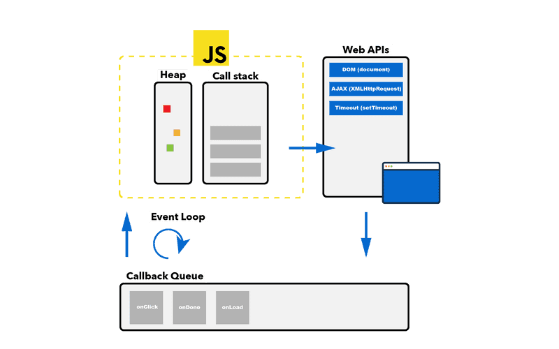

# Event Loop

# The Need for the Event Loop in JavaScript

1. **Non-blocking Asynchronous Operations**: JavaScript is single-threaded, meaning it can only execute one task at a time. Asynchronous operations, such as fetching data from a server, reading files, or handling user interactions, can take some time to complete. The event loop allows JavaScript to handle these operations without blocking the main execution thread. Instead of waiting for an operation to finish, JavaScript can move on to execute other tasks, making the application more responsive.

2. **Responsive User Interfaces**: In web development, the event loop plays a crucial role in building responsive user interfaces. For example, when a user interacts with a web page by clicking a button or typing into an input field, event handlers are triggered and queued in the event loop. The event loop ensures that these event handlers are executed promptly, allowing the user interface to remain responsive and interactive.

3. **Efficient Resource Utilization**: By handling asynchronous operations asynchronously, the event loop helps optimize resource utilization. Instead of idly waiting for I/O operations to complete, JavaScript can execute other tasks or handle additional incoming requests. This efficient use of resources improves overall performance and scalability, especially in server-side applications.

# Tasks Processed in the Event Loop

1. **Asynchronous Callbacks**: Callback functions from asynchronous operations such as `setTimeout`, `setInterval`, `fetch API`, `AJAX requests`, `event handlers` (e.g., click, mouseover), `promises`, and `I/O operations` are queued in the event loop. Once their associated tasks are completed, these callback functions are moved from the event queue to the call stack for execution.

# Tasks Remaining in the Call Stack

1. **Synchronous Code**: Synchronous code executes directly in the call stack, in the order it appears in the code. This includes function calls, variable declarations, assignments, arithmetic operations, loops, and any other synchronous tasks.

2. **Function Calls**: Functions that are invoked in the synchronous code are pushed onto the call stack. If these functions contain synchronous code, it is executed sequentially, and if they contain asynchronous operations, those operations may trigger callbacks that get queued in the event loop.

3. **Execution Contexts**: Each function invocation creates an execution context, which includes the function's scope, arguments, and local variables. These execution contexts are pushed onto the call stack and popped off once the function finishes execution.

4. **Recursive Function Calls**: Recursive function calls result in multiple instances of the function's execution context being pushed onto the call stack. These instances remain in the call stack until the base case is reached and the recursive calls are resolved.

# Execution Order: Call Stack vs. Task Queue

In JavaScript's event-driven architecture, the call stack takes precedence over the task queue. Here's how the execution order works:

**Call Stack**: 
- When a script starts executing, the initial code is pushed onto the call stack for execution.
- Synchronous code executes directly in the call stack, in the order it appears in the code.
- Function calls, variable declarations, assignments, loops, and other synchronous tasks are processed sequentially.

**Task Queue**: 
- Asynchronous tasks, such as callbacks from `setTimeout`, `fetch` API, or event handlers, are not immediately executed.
- Instead, they are queued in the task queue while the call stack is busy executing synchronous code.
- Once the call stack becomes empty, the event loop checks if there are any tasks in the task queue.
- If tasks are found in the task queue, the event loop moves the first task from the queue to the call stack for execution.

**Execution Order**:
1. Initial code is pushed onto the call stack and executed.
2. Synchronous code in the call stack is processed sequentially.
3. Asynchronous tasks are queued in the task queue while the call stack is busy.
4. When the call stack becomes empty, tasks from the task queue are processed by moving them onto the call stack.
5. This mechanism ensures that synchronous code is executed without interruption and that asynchronous tasks are executed in the correct order.

In summary, the call stack is processed first, and once it's empty, tasks from the task queue are processed by moving them onto the call stack. This ensures proper handling of both synchronous and asynchronous operations in JavaScript.
